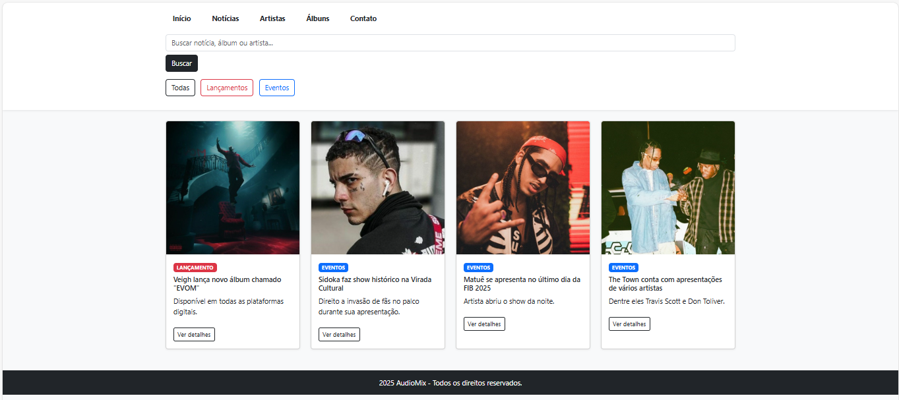
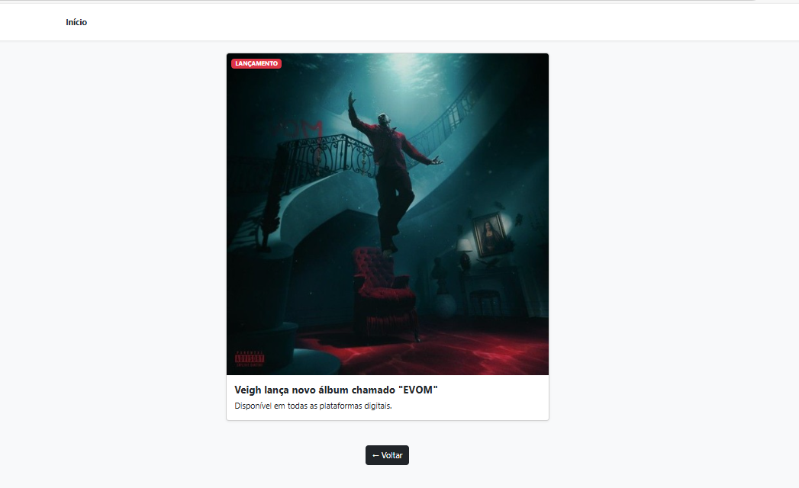

[](https://classroom.github.com/online_ide?assignment_repo_id=20789230&assignment_repo_type=AssignmentRepo)
# Trabalho Prático 05 - Semanas 7 e 8

**Páginas de detalhes dinâmicas**

Nessa etapa, vamos evoluir o trabalho anterior, acrescentando a página de detalhes, conforme o  projeto escolhido. Imagine que a página principal (home-page) mostre um visão dos vários itens que existem no seu site. Ao clicar em um item, você é direcionado pra a página de detalhes. A página de detalhe vai mostrar todas as informações sobre o item do seu projeto. seja esse item uma notícia, filme, receita, lugar turístico ou evento.

Leia o enunciado completo no Canvas. 

**IMPORTANTE:** Assim como informado anteriormente, capriche na etapa pois você vai precisar dessa parte para as próximas semanas. 

**IMPORTANTE:** Você deve trabalhar e alterar apenas arquivos dentro da pasta **`public`,** mantendo os arquivos **`index.html`**, **`styles.css`** e **`app.js`** com estes nomes, conforme enunciado. Deixe todos os demais arquivos e pastas desse repositório inalterados. **PRESTE MUITA ATENÇÃO NISSO.**

## Informações Gerais

- Nome: Hadassa Carvalho
- Matricula: 1593566
- Proposta de projeto escolhida: Artistas e álbuns
- Breve descrição sobre seu projeto: Informações sobre os maiores nomes do gênero, seus lançamentos, álbuns e eventos em tempo real.

## Print da Home-Page



## Print da página de detalhes do item



## Cole aqui abaixo a estrutura JSON utilizada no app.js

```javascript
const noticias = [
  {
    id: 1,
    titulo: 'Veigh lança novo álbum chamado "EVOM"',
    descricao: 'Disponível em todas as plataformas digitais.',
    imagem: 'imagens/EVOM.jpg',
    categoria: 'LANÇAMENTO',
    corCategoria: 'danger'
  },
  {
    id: 2,
    titulo: 'Sidoka faz show histórico na Virada Cultural',
    descricao: 'Direito a invasão de fãs no palco durante sua apresentação.',
    imagem: 'imagens/SIDOKA.jpg',
    categoria: 'EVENTOS',
    corCategoria: 'primary'
  },
  {
    id: 3,
    titulo: 'Matuê se apresenta no último dia da FIB 2025',
    descricao: 'Artista abriu o show da noite.',
    imagem: 'imagens/MATUE.jpg',
    categoria: 'EVENTOS',
    corCategoria: 'primary'
  },
  {
    id: 4,
    titulo: 'The Town conta com apresentações de vários artistas',
    descricao: 'Dentre eles Travis Scott e Don Toliver.',
    imagem: 'imagens/thetown.jpg',
    categoria: 'EVENTOS',
    corCategoria: 'primary'
  }
];
]
```
